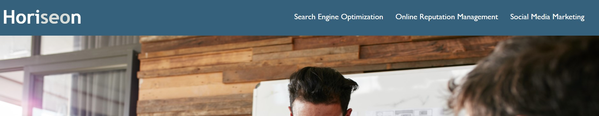
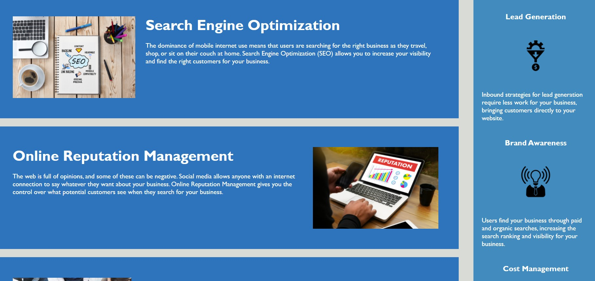

Horizeon Homepage

Updated code for Horizeon Homepage to adjust a fix the links on the top of the page to work so someone can visit the page, everything works, and they can get a full idea of what the company offers. Cleaned code to add HTML semantics, simplified CSS file, updated title, added alt attributes for accessibility, and ensured code flows logically.

Used HTML and CSS for website.

On the top of the page, there is a navigation bar linking to other areas of the page:

This brings to the main content of the page:

View the website here: https://meggedde.github.io/first-challenge/

